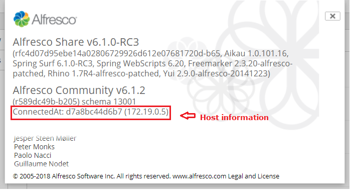
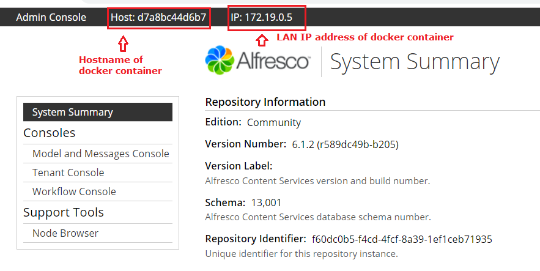

# about-share-and-adminconsole-extension
Extends the 'about-share' module and admin console system summary page to display HostName and LAN IP Address
This is an All-In-One (AIO) project for Alfresco SDK 4.0.

# Prerequisite

##### Understand the concept:
`https://docs.alfresco.com/6.0/concepts/deploy-concepts.html`

##### Required Tools and deployment:
Before starting with SDK4.x and docker based project, Install docker on your development environment.
Follow instructions given here: `https://docs.docker.com/install/`
You may have to create an account on docker hub.

Go to: `https://hub.docker.com/signup?next=%2F%3Foverlay%3Donboarding` to create an account. 

Visit here for more details: `https://docs.alfresco.com/6.0/concepts/deploy-prereqs.html`

# Getting started

Run with `./run.sh build_start` or `./run.bat build_start` and verify that it

 * Runs Alfresco Content Service (ACS)
 * Runs Alfresco Share
 * Runs Alfresco Search Service (ASS)
 * Runs PostgreSQL database
 * Deploys the JAR assembled modules
 
All the services of the project are now run as docker containers. The run script offers the next tasks:

 * `build_start`. Build the whole project, recreate the ACS and Share docker images, start the dockerised environment composed by ACS, Share, ASS and 
 PostgreSQL and tail the logs of all the containers.
 * `build_start_it_supported`. Build the whole project including dependencies required for IT execution, recreate the ACS and Share docker images, start the 
 dockerised environment composed by ACS, Share, ASS and PostgreSQL and tail the logs of all the containers.
 * `start`. Start the dockerised environment without building the project and tail the logs of all the containers.
 * `stop`. Stop the dockerised environment.
 * `purge`. Stop the dockerised container and delete all the persistent data (docker volumes).
 * `tail`. Tail the logs of all the containers.
 * `reload_share`. Build the Share module, recreate the Share docker image and restart the Share container.
 * `reload_acs`. Build the ACS module, recreate the ACS docker image and restart the ACS container.
 * `build_test`. Build the whole project, recreate the ACS and Share docker images, start the dockerised environment, execute the integration tests from the
 `integration-tests` module and stop the environment.
 * `test`. Execute the integration tests (the environment must be already started).

 
# Sample of about share popup

Note: Host information will displayed only if users are Administrators.

# Sample of Admin console

